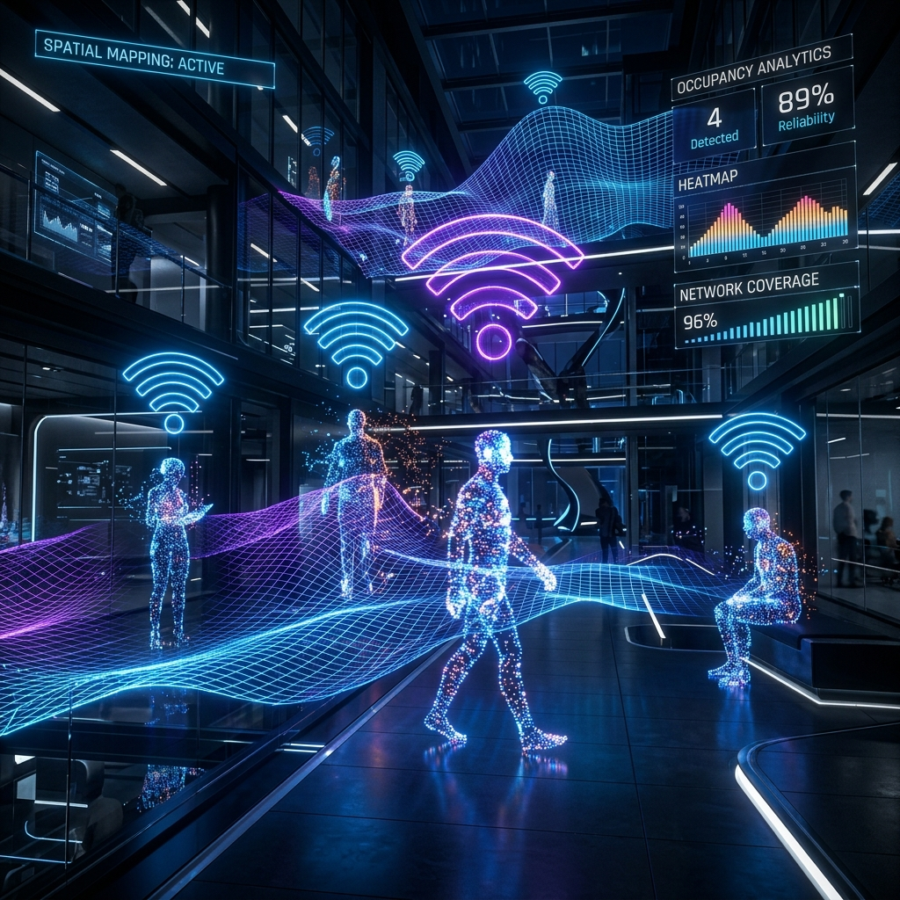
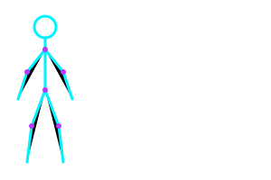
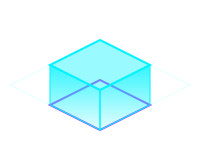

<div align="center">
  
  
  <br />
  <br />
  

  <h1 align="center">WaveMap: Advanced Spatial Visualization Platform</h1>
  <p align="center">
    <strong>A next-generation, high-performance 3D web application for real-time spatial mapping, human telemetry tracking, and environmental analytics.</strong>
  </p>

  <p align="center">
    <a href="https://github.com/shakirali78690/WaveMap/stargazers"></a>
    <a href="https://github.com/shakirali78690/WaveMap/network/members"></a>
    <a href="https://github.com/shakirali78690/WaveMap/issues"></a>
  </p>
  
  <p align="center">
    
    
    
    
    
  </p>
</div>

---

## 🌌 Introduction

**WaveMap** is a cutting-edge spatial intelligence platform designed for the future of environment monitoring. By seamlessly translating raw data telemetry (like Channel State Information and RF signals) into a beautiful, immersive 3D space, WaveMap bridges the gap between invisible data and actionable spatial analytics.

Whether you're tracking human movement in an office, analyzing the structural layout of a warehouse, or developing advanced WiFi sensing algorithms, WaveMap provides a flawless, real-time visualization layer.

<div align="center">
  
</div>

## ✨ Core Ecosystem

WaveMap isn't just a UI; it's a comprehensive ecosystem comprising four major pillars:

### 1. 🌐 The 3D Engine (React Three Fiber)
At the heart of WaveMap is a highly optimized WebGL engine built on Three.js and React Three Fiber.

<div align="center">
  
</div>

- **Instanced Rendering:** Handles thousands of data points and geometries with zero frame drops.
- **Dynamic Avatars:** Human tracking represented by articulated, animated 3D models with confidence-based opacity.
- **Volumetric Lighting & Shaders:** Custom shaders that give the environment a glowing, holographic cyberpunk aesthetic.

### 2. 📡 Real-Time Telemetry Pipeline

<div align="center">
  
</div>

WaveMap thrives on live data. The application utilizes a highly resilient WebSocket adapter to ingest massive amounts of streaming telemetry.
- **Sub-10ms Latency:** Optimized event loops ensure that movements in the real world reflect instantly in the 3D space.
- **JSON Payload Processing:** Clean `onMessage` handlers map incoming X, Y, Z coordinates directly to Zustand stores, entirely bypassing React's standard (and slower) render cycle for critical position updates.

### 3. 🛠️ Canvas Room Editor

<div align="center">
  
</div>

A powerful built-in 2D editor that allows users to map physical spaces dynamically.
- **Draw & Extrude:** Map 2D walls on the canvas, and watch them instantly extrude into 3D objects in the viewport.
- **Asset Placement:** Place nodes, routers, and furniture accurately to reflect real-world RF obstacles.

### 4. 🧠 Simulation Engine

<div align="center">
  
</div>

Developing without hardware? WaveMap includes a highly sophisticated, deterministic mock-data engine (`src/data/simulator.ts`).
- **Realistic Trajectories:** Generates plausible walking paths using room-aware waypoint navigation.
- **Dynamic Posing:** Computes localized skeleton joints on the fly. If an avatar stops moving (e.g., speed drops below 0.1 m/s), the simulation generates realistic "idle" or "sitting" poses.
- **RF Attenuation Modeling:** Confidence values are derived by casting rays between virtual occupants and sensors, properly dropping tracking quality through thick walls.
- **Edge-Cases Included:** Simulates network latency, positional jitter, and total signal drops to ensure your frontend is highly resilient.

---

## 🛠️ Architecture Breakdown

The codebase is strictly typed and organized for enterprise scalability:

```text
📦 WaveMap
 ┣ 📂 src
 ┃ ┣ 📂 adapters      # WebSocket and Mock Simulator data ingestion layers
 ┃ ┣ 📂 components    # React UI components (Dashboard, 3D Scene)
 ┃ ┣ 📂 data          # Types, Sample Houses, and Simulator Logic
 ┃ ┣ 📂 stores        # Zustand state management (UI, Entities, Sensing)
 ┃ ┣ 📂 styles        # Vanilla CSS, CSS Variables, Glassmorphism utilities
 ┃ ┗ 📂 engine        # Core physics, tracker smoothing, and derivations
 ┣ 📂 public          # Static assets, hero images, animated SVGs
 ┣ 📜 index.html      # Vite entry point
 ┗ 📜 vite.config.ts  # Optimized build configuration
```

### State Management Strategy
We use **Zustand** extensively to separate 3D rendering from UI rendering. By keeping entity coordinates in transient stores, the `useFrame` loop in Three.js can read positions directly and apply shortest-path angle interpolation without triggering expensive React component re-renders.

---

## 📡 Hardware Integration (Real-World Setup)

While the simulation is great for UI development, WaveMap is ultimately built to be a frontend for physical sensing hardware like **TI mmWave Radars**, **ESP32 CSI** arrays, or camera tracking systems.

### Switching to the WebSocket Adapter
To bypass the simulation and use real hardware, switch the data source in your initialization code to the built-in **WebSocket Adapter** (`src/data/adapters/websocket.ts`).

This adapter establishes a highly resilient, auto-reconnecting WebSocket link to your backend server.

### The Expected Payload
Your hardware or Python backend simply needs to broadcast JSON payloads in the following `DetectionFrame` format. WaveMap will automatically parse, smooth, and render the physical tracking data in 3D space:

```json
{
  "type": "frame",
  "data": {
    "seq": 1042,
    "ts": 1714316400000,
    "sqi": 0.85,
    "entities": [
      {
        "id": "human_01",
        "floorId": "floor-1",
        "position": { "x": 4.52, "y": 0.0, "z": -2.15 },
        "velocity": { "x": 0.5, "y": 0.0, "z": 0.1 },
        "heading": 1.57,
        "confidence": 0.92,
        "state": "walking"
      }
    ],
    "events": []
  }
}
```

---

## 🚀 Installation & Deployment

### Prerequisites
- **Node.js**: v18.0.0 or higher.
- **Hardware Acceleration**: A modern browser with WebGL 2.0 support enabled.

### Local Development Setup

1. **Clone the repository:**
   ```bash
   git clone https://github.com/shakirali78690/WaveMap.git
   cd WaveMap
   ```

2. **Install the dependencies:**
   ```bash
   npm install
   # or
   yarn install
   # or
   pnpm install
   ```

3. **Start the local Vite server:**
   ```bash
   npm run dev
   ```

4. **Open WaveMap:**
   Navigate to `http://localhost:5173`. The simulation engine will automatically initialize if no live WebSocket connection is detected.

### Production Build

To compile WaveMap for production deployment (generates heavily minified and chunk-split assets):

```bash
npm run build
npm run preview
```
The resulting `dist/` folder can be hosted on Vercel, Netlify, AWS S3, or any standard static hosting service.

---

## 🎨 UI & Aesthetic Philosophy

WaveMap uses a **Deep Dark Mode** aesthetic tailored for analytical clarity.
- **Glassmorphism:** Dashboard panels use backdrop filters to allow the 3D environment to bleed through.
- **Neon Accents:** Cyan (`#00f3ff`) and Purple (`#b73bfe`) are used strategically to indicate data flow, active nodes, and positive alerts.
- **Micro-Animations:** Every button hover, panel opening, and data tick features customized CSS transition curves (`cubic-bezier`).

<div align="center">
  
</div>

## 🤝 Contributing

We welcome contributions from the community! Whether it's adding new 3D models, optimizing the WebSocket adapter, or writing documentation:
1. Fork the project.
2. Create your feature branch (`git checkout -b feature/AmazingFeature`).
3. Commit your changes (`git commit -m 'Add some AmazingFeature'`).
4. Push to the branch (`git push origin feature/AmazingFeature`).
5. Open a Pull Request.

---
<div align="center">
  <p>Engineered with 💡 and 📡 for the future of web-based spatial intelligence.</p>
</div>
